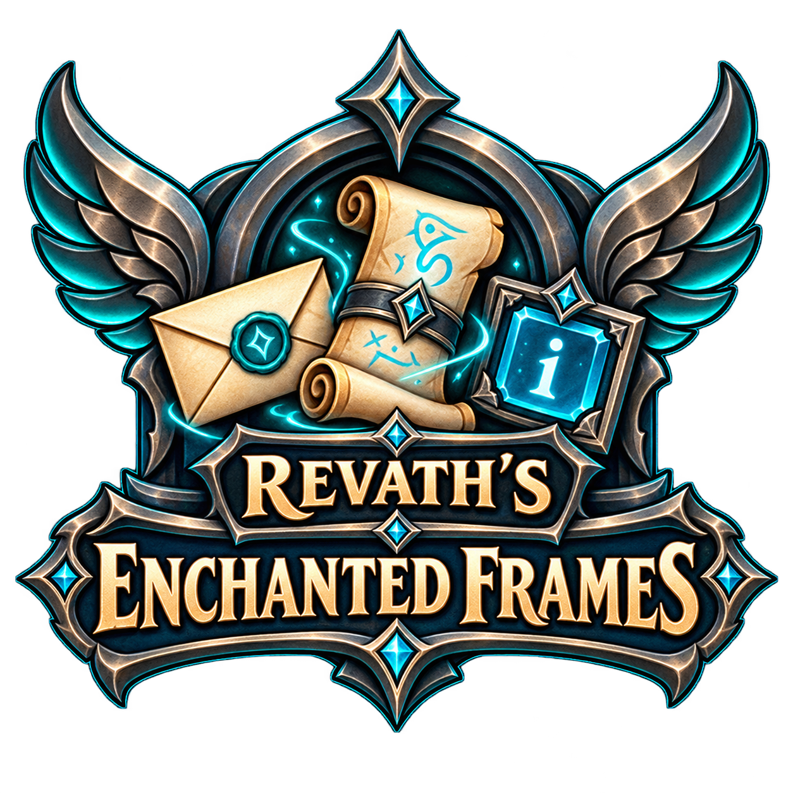

# Revath's Enchanted Frames

Revath's Enchanted Frames is a modular World of Warcraft Retail addon suite that combines a customizable mailbox replacement, an advanced macro workshop, and account-wide item-count tooltips under one shared parent addon and one Blizzard Settings category.

## Modules

- **Revath's Enchanted Frames** — shared parent, suite metadata, author information, and centralized Blizzard Settings pages.
- **Revath's Enchanted Mailbox** — inbox tools, New Mail editor, contacts, quick attachments, alt tracking, Modern and Classic skins, palettes, fonts, opacity, and scaling.
- **Revath's Enchanted Macros** — separate account and character macro libraries, curated class/spec templates, icon picker, drag-to-action-bar, syntax suggestions, usable-item suggestions, and Modern or Classic skins.
- **Revath's Enchanted Tooltips** — account-wide bag, bank, and Warband-bank item totals with Shift details per character.

## Install or upgrade

1. Extract all four folders into `_retail_/Interface/AddOns/`, replacing the existing module folders when prompted:
   - `RevathsEnchantedFrames`
   - `RevathsMailbox`
   - `RevathsMacro`
   - `RevathsMailboxTooltipHelper`
2. Restart WoW or type `/reload`.

The three child modules keep their established technical folder IDs so WoW automatically loads your existing saved-variable files. Their visible in-game names are **Revath's Enchanted Mailbox**, **Revath's Enchanted Macros**, and **Revath's Enchanted Tooltips**. Existing settings, macro preferences, and tracked item data migrate without a manual reset.

## Settings and commands

Open **Options → AddOns → Revath's Enchanted Frames** for the suite overview and Mailbox, Macros, and Tooltips subpages.

- `/ref` or `/enchantedframes` opens the shared addon settings.
- `/rmail` or `/revathsmailbox` opens the mailbox while a mailbox NPC/object is active.
- `/rmacro` or `/macroworkshop` opens Revath's Enchanted Macros.

## Compatibility

- World of Warcraft Retail / Midnight 12.1 (`Interface: 120100`)
- Optional LibSharedMedia font discovery through compatible installed addons
- No external network access from inside the game

## Author and support

Created by **Revath#2331 (Revathify)**.

Support the project at [Buy Me a Coffee](https://buymeacoffee.com/revath).
